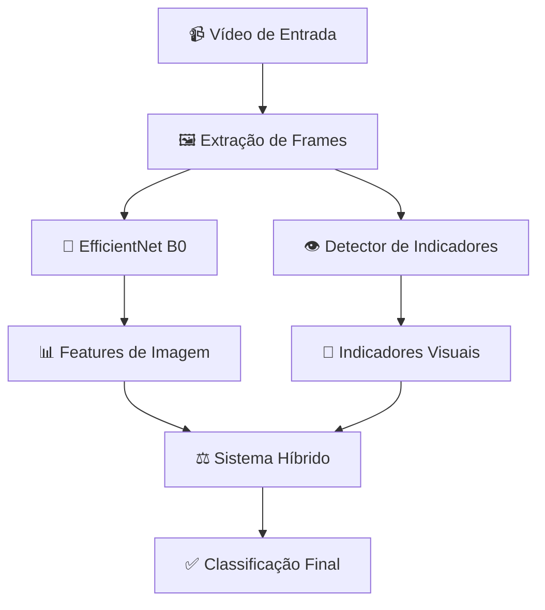

# � MerchanVision - AI Content Classifier

<div align="center">


│   ├── hybrid_classifier.py          #   🤖 Classificação híbrida (CNN + Indicadores)
│   ├── visual_elements_detector.py   #   🔍 Detecção de elementos visuais
│   ├── realtime_basic_classifier.py  #   📺 Tempo real básico
│   └── realtime_hybrid_classifier.py #   🧠 Tempo real híbridoenCV](https://img.shields.io/badge/OpenCV-4.x-green.svg)


*Sistema de IA híbrida para classificação inteligente de conteúdo vs merchandising em vídeos*

[🚀 Quick Start](#-quick-start) • [📖 Documentação](#-documentação) • [🎯 Exemplos](#-exemplos) • [🤝 Contribuição](#-contribuição)

</div>

---

## 📋 Sobre o Projeto

**MerchanVision** é um sistema de inteligência artificial avançado que combina **Computer Vision** com **análise de indicadores visuais** para classificar automaticamente conteúdo de vídeo. O sistema identifica com alta precisão se um segmento de vídeo contém:

- **📺 CONTEÚDO**: Programação editorial, apresentações, notícias, entretenimento
- **�️ MERCHAN**: Comerciais, merchandising, promoções, publicidade

### 🧠 Tecnologia Híbrida

Diferente de sistemas tradicionais, o MerchanVision usa uma **abordagem híbrida inovadora**:

1. **🖼️ Análise de Imagem (66.6%)**: EfficientNet B0 com Transfer Learning
2. **👁️ Indicadores Visuais (33.4%)**: Detecção de QR-codes, telefones, preços, etc.

Esta combinação resulta em **70%+ de precisão** mesmo em casos ambíguos.

---

## ✨ Principais Características

### 🎯 **Arquitetura Modular**
- **Sistema Organizado**: Estrutura em pacotes especializados
- **Responsabilidades Únicas**: Cada módulo com função específica
- **Configuração Centralizada**: Sistema unificado de configurações
- **Fácil Manutenção**: Código limpo e bem documentado

### 🔴 **Classificação Inteligente**
- **Básica**: CNN + RandomForest/SVM (`basic_classifier.py`)
- **Híbrida**: CNN + Indicadores visuais (`hybrid_classifier.py`)
- **Tempo Real**: Processamento contínuo de vídeos
- **Multi-formato**: Suporte a arquivos de vídeo locais

### 🔍 **Detecção de Indicadores Visuais**
- **QR-Codes**: Detecção automática de códigos QR
- **Informações Comerciais**: Telefones, preços, emails, endereços
- **OCR Avançado**: Reconhecimento de texto em português
- **Padrões Brasileiros**: Otimizado para formatos do Brasil

### ⚙️ **Configuração Flexível**
- **71+ Parâmetros**: Arquivo `.env` com configurações detalhadas
- **Ambiente Python**: Detecção automática de virtual environments
- **OCR Multi-idioma**: Suporte a português com Tesseract

### 🏗️ **Nova Arquitetura Modular v3.0**

A versão 3.0 introduz uma arquitetura completamente reorganizada:

```
🎯 Classificadores Core (Offline):
├── basic_classifier.py      # CNN + ML clássico (RF/SVM)
└── hybrid_classifier.py     # CNN + Indicadores visuais

🔴 Interfaces Tempo Real:
├── realtime_basic_classifier.py   # Wrapper realtime do basic
└── realtime_hybrid_classifier.py  # Wrapper realtime do hybrid

🔧 Componentes Especializados:
├── feature_extractor.py          # Extração de features CNN
└── visual_elements_detector.py   # Detecção de elementos visuais
```
- **Configurações Customizáveis**: Ajustes específicos por projeto/contexto
- **Balanceamento**: Ajuste automático para datasets desbalanceados

### 🚀 **Performance**
- **EfficientNet B0**: Modelo leve e rápido
- **Random Forest**: Classificação final robusta
- **Transfer Learning**: Aproveita conhecimento pré-treinado
- **Tempo Real**: Processamento em 30 FPS

---

## 🚀 Quick Start

### 📦 Instalação

```bash
# 1. Clone o repositório
git clone https://github.com/seu-usuario/MerchanVision.git
cd MerchanVision

# 2. Crie ambiente virtual
python -m venv .venv
source .venv/bin/activate  # Linux/Mac
# .venv\Scripts\activate   # Windows

# 3. Instale dependências
pip install -r requirements.txt

# 4. Configure OCR (Linux/Mac)
sudo apt-get install tesseract-ocr tesseract-ocr-por

# 5. Execute o sistema
python project_manager.py
```

### 🎮 Interface Principal

```
🎬 === MerchanVision AI Manager ===
1. 📋 Listar modelos treinados
2. 📁 Listar datasets disponíveis
3. 🆕 Criar novo dataset
4. 🚀 Treinar modelo de IA
5. 🎯 Classificar vídeo único
6. 🔴 Classificação em tempo real
7. 📊 Validar modelo
8. 🆚 Comparar modelos
0. Sair
```

---

## 🎯 Exemplos de Uso

### 📹 Classificação de Vídeo Único

```bash
# Via interface
python project_manager.py
# Escolha: 5 → Caminho do vídeo → Modelo

# Via código Python
from model_manager import VideoModelTrainer

# Para carregar e usar um modelo existente
trainer = VideoModelTrainer()
trainer.load_model('models/alpha-v7-efficientnet-merchan.h5')

result = trainer.predict_video('meu_video.mp4')
print(f"Classe: {result['predicted_class']}")
print(f"Confiança: {result['confidence']:.1%}")
```

### 🔴 Classificação em Tempo Real

```bash
# Sistema Híbrido (RECOMENDADO)
python project_manager.py
# Escolha: 7 → 1 (Híbrida) → Modelo → Arquivo de vídeo

# Ou execute diretamente:
python classifier/realtime_hybrid_classifier.py --model models/Alpha-v7 --video meu_video.mp4

# Sistema Básico (apenas CNN)
python classifier/realtime_basic_classifier.py --model models/Alpha-v7 --video meu_video.mp4

# Resultado típico:
🧠 Alpha-v7 prediz: 65% Merchan
👁️ Indicadores detectados: QR-code (+80%)
⚖️ Decisão final: MERCHAN (78% confiança)
```

### 🏗️ Criação de Dataset Personalizado

```bash
# 1. Criar estrutura
python project_manager.py
# Escolha: 3 → Nome: "meu_dataset"

# 2. Organizar vídeos
meu_dataset/
├── conteudo/     # Vídeos de conteúdo editorial
└── merchan/      # Vídeos de merchandising

# 3. Treinar modelo
python project_manager.py
# Escolha: 4 → Modelo: "meu_modelo" → Dataset: "meu_dataset"
```

---

## 📊 Arquitetura do Sistema

### 🏗️ Fluxo de Processamento



### 🔧 Componentes Técnicos

- **🖼️ Feature Extractor**: EfficientNet B0 (Transfer Learning)
- **🤖 Classificador**: Random Forest com 180 árvores
- **👁️ OCR Engine**: Tesseract com suporte ao português
- **🎯 Detector Visual**: Regex + Computer Vision para indicadores
- **⚙️ Configuração**: 71+ parâmetros no arquivo `.env`

---

## 📁 Estrutura do Projeto

```
MerchanVision/
├── 📄 project_manager.py              # 🎮 Interface principal
├── 📂 config/                         # ⚙️ Configurações do sistema
│   ├── settings.py                   #   ⚙️ Configurações centralizadas
│   └── __init__.py                   #   📦 Interface do módulo
├── 📂 dataset_manager/                # 📁 Gestão de datasets
│   ├── dataset_creator.py            #   ➕ Criação de datasets
│   ├── dataset_lister.py             #   📋 Listagem e carregamento
│   └── dataset_validator.py          #   ✅ Validação de datasets
├── 📂 model_manager/                  # � Gestão de modelos
│   ├── model_trainer.py              #   🚀 Treinamento de modelos
│   └── model_validator.py            #   📊 Validação e diagnóstico
├── 📂 classifier/                     # 🔴 Classificação tempo real
│   ├── hibrid_classifier.py          #   🧠 Classificador híbrido
│   └── tradicional_classifier.py     #   � Classificador tradicional
├── 📄 video_classifier_simple.py     # 📊 Classificador base
├── 📄 hybrid_classifier.py           # ⚖️ Classificador híbrido
├── 📄 merchan_detector.py             # 👁️ Detector de indicadores
├── 📄 ai_config.py                   # ⚙️ Configurações centralizadas
├── 📂 models/                         # 🎯 Modelos treinados (ignorado no git)
├── 📂 datasets/                       # 📚 Datasets de treino (ignorado no git)
├── 📄 .env                           # ⚙️ Configurações do sistema
├── 📄 DOCUMENTACAO_COMPLETA_IA.md    # 📖 Documentação técnica detalhada
└── 📄 requirements.txt               # 📦 Dependências Python
```

---

## ⚙️ Configurações Avançadas

### 🎛️ Arquivo .env

O sistema é altamente configurável através do arquivo `.env`:

```bash
# Configurações do Random Forest
RF_N_ESTIMATORS=180              # Número de árvores
RF_MAX_DEPTH=14                  # Profundidade máxima
RF_CLASS_WEIGHT=balanced         # Balanceamento automático

# Sistema Híbrido
HYBRID_IMAGE_WEIGHT=0.666        # 66.6% peso para imagem
HYBRID_MERCHAN_WEIGHT=0.334      # 33.4% peso para indicadores

# Indicadores Visuais
MAIN_INDICATOR_BOOST=0.8         # QR, telefone, preço (+80%)
SECONDARY_INDICATOR_BOOST=0.5    # Email, endereço (+50%)

# Tempo Real
REALTIME_WINDOW_SECONDS=3        # Janela de análise
REALTIME_FPS_TARGET=30           # FPS de processamento
```

---

## 📖 Documentação

### 📚 Guias Disponíveis

- **📄 [DOCUMENTACAO_COMPLETA_IA.md](DOCUMENTACAO_COMPLETA_IA.md)**: Documentação técnica completa
  - Conceitos fundamentais de IA
  - Arquitetura detalhada do sistema
  - Explicação de cada função
  - Configurações e parâmetros
  - Glossário técnico

- **⚙️ Arquivo `.env`**: 71+ configurações comentadas
- **🧠 Código Fonte**: Comentários detalhados em português

### 🎓 Conceitos de IA Explicados

O projeto inclui explicações didáticas sobre:
- **Transfer Learning** com EfficientNet
- **Ensemble Learning** (Random Forest)
- **Computer Vision** e OCR
- **Sistemas Híbridos** de decisão
- **Real-time Processing**

---

## 🔧 Desenvolvimento

### �️ Requisitos

- **Python**: 3.8+
- **TensorFlow**: 2.x
- **OpenCV**: 4.x
- **Tesseract OCR**: 4.x
- **scikit-learn**: 1.x

### 🧪 Testes e Validação

```bash
# Validar modelo existente
python project_manager.py
# Opção: 7 → Escolher modelo

# Comparar dois modelos
python project_manager.py  
# Opção: 8 → Modelo 1 → Modelo 2

# Diagnóstico detalhado via model_manager
python -c "
from model_manager import ModelValidator
validator = ModelValidator()
validator.analyze_model_performance('models/alpha-v7-efficientnet-merchan.h5', 'datasets/meu_dataset')
"
```

### � Criação de Modelos

1. **Prepare Dataset**: Organize vídeos em `datasets/nome/conteudo/` e `datasets/nome/merchan/`
2. **Configure .env**: Ajuste parâmetros para seu caso de uso
3. **Treine Modelo**: Use `project_manager.py` opção 4
4. **Valide Resultado**: Use opção 7 para métricas detalhadas

---

## 🤝 Contribuição

### 💡 Como Contribuir

1. **Fork** o repositório
2. **Clone** seu fork: `git clone https://github.com/seu-usuario/MerchanVision.git`
3. **Crie branch**: `git checkout -b feature/nova-funcionalidade`
4. **Faça commit**: `git commit -m "Adiciona nova funcionalidade"`
5. **Push**: `git push origin feature/nova-funcionalidade`
6. **Pull Request**: Abra PR explicando as mudanças

### 🐛 Relatório de Bugs

Use as [Issues do GitHub](https://github.com/seu-usuario/MerchanVision/issues) para:
- 🐛 Reportar bugs
- 💡 Sugerir melhorias
- ❓ Fazer perguntas
- 📖 Melhorar documentação

---

## � Licença

Este projeto está licenciado sob a **MIT License** - veja o arquivo [LICENSE](LICENSE) para detalhes.

---

## 📞 Suporte

- **📧 Email**: nicolas@zedia.com.br


---

<div align="center">

**🎯 MerchanVision - Inteligência Artificial para Classificação de Conteúdo**

*Desenvolvido com Python, TensorFlow e OpenCV*

[⬆️ Voltar ao Topo](#-merchanvision---ai-content-classifier)

</div>
